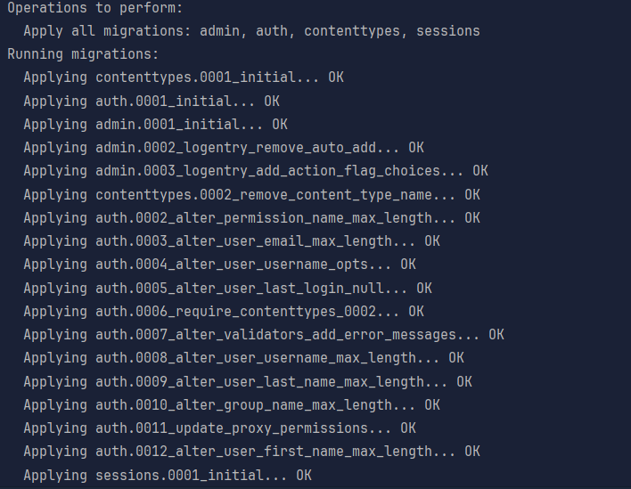
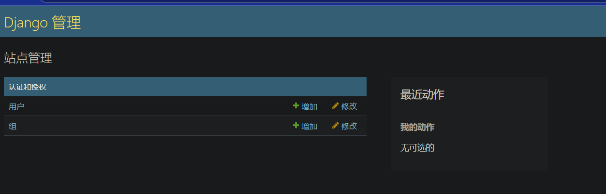

# 新建项目
```shell
django-admin startproject quick_start_01
```
# 启动项目
```shell
python manage.py runserver
```

# 项目文件
**quick_start_01/qucik_start_01 # 项目目录  
quick_start_01/manage.py # 管理文件.  
quick_start_01/qucik_start_01/__init__.py # 初始化文件.  
quick_start_01/qucik_start_01/settings.py # 配置文件.  
quick_start_01/qucik_start_01/urls.py # 路由文件.  
quick_start_01/qucik_start_01/wsgi.py # 服务器文件  
quick_start_01/qucik_start_01/asgi.py # 异步服务器文件.**
# 自动打开
```python
import webbrowser
webbrowser.open('http://localhost: 8000')
```
# migrations 迁移
```shell
python manage.py migrate
```

## admin 模块
- 作用：提供 Django 管理后台（Admin）的功能。
- 模型：LogEntry（记录管理员的操作日志）。
- 位置：django/contrib/admin/models.py（Django 源码的一部分）。
## auth 模块
- 作用：提供用户认证和权限管理功能。
- 模型：
  User（用户模型，用于存储用户信息）。
  Group（用户组模型，用于分组管理）。
  Permission（权限模型，用于定义权限）。
-位置：django/contrib/auth/models.py。
## contenttypes 模块
- 作用：提供内容类型框架，用于动态地处理不同模型的类型信息。
- 模型：ContentType（存储每个模型的元信息，如应用名称、模型名称等）。
- 位置：django/contrib/contenttypes/models.py。
## sessions 模块
- 作用：提供会话管理功能，用于存储用户的会话信息。
- 模型：Session（存储会话数据）。
- 位置：django/contrib/sessions/models.py。
# 创建superuser
```shell
python manage.py createsuperuser --noinput --username=admin --email=admin@example.com
```
# 通过shell设置密码
```shell
python manage.py shell
```
```python
from django.contrib.auth.models import User
user = User.objects.get(username='admin')
user.set_password('123456')
user.save()
```
# 进入admin

