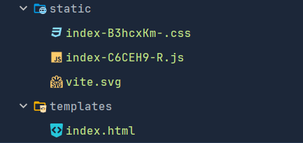

# 开启项目
```shell
python ./manage.py runserver
```
# 创建子应用
```shell
cd src/show_data_02
python manage.py startapp goods
```
# 子应用
views.py # 视图文件
models.py # 模型文件
admin.py # 管理文件
apps.py # 应用配置文件
migrations # 数据库迁移文件
tests.py # 测试文件
urls.py # 路由文件
# 创建路由
```python
# goods/urls.py
from django.http.response import HttpResponse
from django.http.request import HttpRequest
from django.views.decorators.http import require_http_methods, require_GET


# require_http_methods(['GET'])
@require_GET
def index(request: HttpRequest):
    print(request.GET)
    return HttpResponse('123123')

```
# 配置路由
```python
# show_data_02/urls.py
from django.urls import path, include
urlpatterns = [
    path('goods/', include('goods.urls')),
]
# goods/urls.py
from django.urls import path
from . import views


urlpatterns=[
    path('', views.index),
]
```
# request对象
request.GET # 获取get请求参数
request.POST # 获取post请求参数
request.method # 获取请求方法
request.path # 获取请求路径
request.body # 获取请求体
request.header # 获取请求头
request.COOKIES # 获取cookie
request.session # 获取session
对象封装了用户请求的所有信息，包括请求方法、请求头、请求体、查询参数、用户会话（session）等。
视图函数可以通过 request 对象获取这些信息，并根据这些信息生成响应
# get请求 与 post请求
```python
@csrf_exempt
@require_http_methods(['POST'])
def index_post(request:HttpRequest)->JsonResponse:
    print(request.POST) # <QueryDict: {'params': ['123']}>
    print(request.POST.get('data')) # 123
    
    return JsonResponse({'status': 'ok'})
```
# 前端代理及打包
```js
// vite.config.js
import { defineConfig } from 'vite'
import react from '@vitejs/plugin-react'

// https://vite.dev/config/
export default defineConfig({
  plugins: [react()],
  base:'./',
  build:{
    outDir:'templates',
    assetsDir:'static',
  },
  server:{
    proxy:{
      '/api':{
        target:'http://localhost:8000',
        changeOrigin:true,
        rewrite:path=>path.replace(/^\/api/,'')
      }
    }
  }
})
```
# 前端打包后的文件位置
如图所示  

# 前端打包后settings.py配置 
```python
'DIRS': [BASE_DIR/ 'templates']  # 指向前端模板文件夹
STATICFILES_DIRS = [
    BASE_DIR/'static'  # 指向前端静态文件夹
]
```
# 前端打包后的urls.py配置
```python
from django.urls import re_path
from django.views.generic import TemplateView
urlpatterns = [
   ....
   path('api/goods', include('goods.urls')),
    re_path(r'^.*$', TemplateView.as_view(template_name='index.html')), 
]
```
# 前端打包后的index.html
```html

<!doctype html>
<html lang="en">
  <head>
    <meta charset="UTF-8" />
    <link rel="icon" type="image/svg+xml" href="" />
    <meta name="viewport" content="width=device-width, initial-scale=1.0" />
    <title>Vite + React</title>
    <script type="module" crossorigin src="./static/index-C6CEH9-R.js"></script>
    <link rel="stylesheet" crossorigin href="./static/index-B3hcxKm-.css">
  </head>
  <body>
    <div id="root"></div>
  </body>
</html>
```


